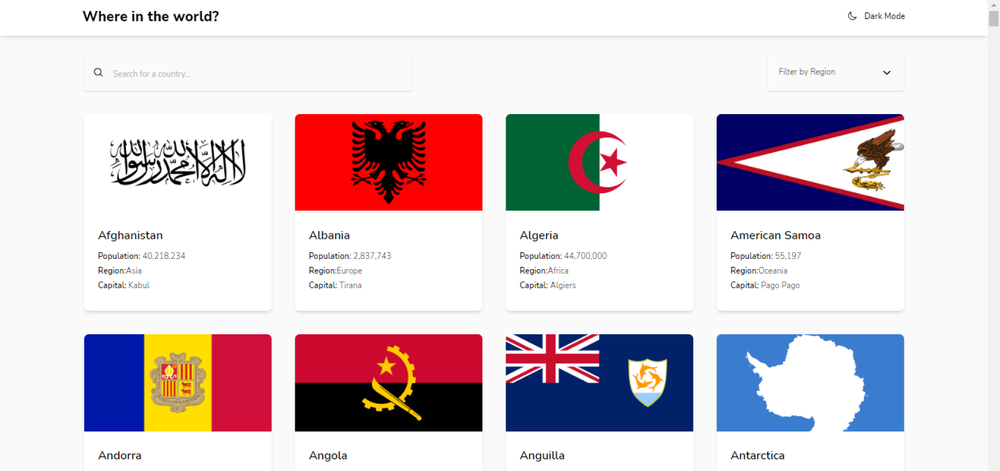

# Frontend Mentor - REST Countries API with color theme switcher

(./screenshot-web (2).jpg)(./screenshot-web (3).jpg)

  <h3>
    <a href="https://rest-countries-api-fadelun.vercel.app/">
      Live
    </a>
     | 
    <a href="https://www.frontendmentor.io/solutions/dark-mode-with-localhost-in-react-js-EESaOSLCWJ">
      Solution
    </a>
    | 
    <a href="https://www.frontendmentor.io/challenges/rest-countries-api-with-color-theme-switcher-5cacc469fec04111f7b848ca">
      Challenge
    </a>
  </h3>

 

Challenge by <a href="https://www.frontendmentor.io/challenges/rest-countries-api-with-color-theme-switcher-5cacc469fec04111f7b848ca" target="_blank" >Frontend Mentor</a>. Coded by <a href="https://github.com/fadelun" >Muhammad Fadll</a>.

 
 
 
 
 
 
